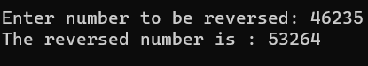

# Recursive-function

## Aim: To write a C# program to reverse a number using recursive function.

## Algorithm:
### Step 1:
Create a class called reverse.

### Step 2:
Create a recursive function named RevNum to reverse the number

### Step 3:
In the function find reminder of the number and multiply it by 10 and add the reverse number.

### Step 4:
Recusively call this function to get the reversed number.

### Step 5:
Create a Main function

### Step 6:
Get input from the user for the number to be reversed.

### Step 7:
Call the function RevNum

### Step 8:
End of the program.

## Program:
```
Developed By : SRIJITH R
Register Number : 212221240054
```
```c#
using System;

class Program
{
    static int reverse(int num, int rev)
    {
        if (num == 0)
        {
            return rev;
        }
        else
        {
            rev = rev * 10 + num % 10;
            return reverse(num / 10, rev);
        }
    }
    static void Main(string[] args)
    {
        int num, rev = 0;
        Console.Write("Enter a number: ");
        num = int.Parse(Console.ReadLine());

        rev = reverse(num, rev);
        Console.WriteLine("Reverse of {0} is {1}", num, rev);
    }
}
```
## Output:


## Result:
Thus C# program to reverse a number using recursive function is written and executed sucessfully.